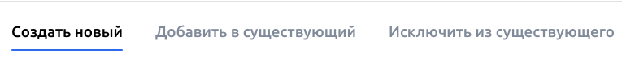
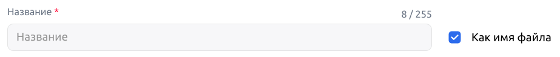
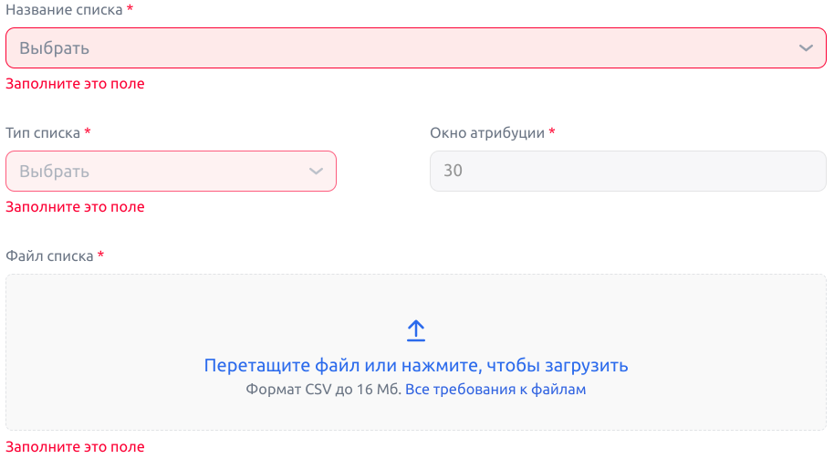

# Аудитории
[Ссылка на страницу Аудитории](https://ads.vk.com/hq/audience)

## Содержание
1. [Вкладка "Аудитории"](#вкладка-аудитории)
    - [Меню "Создание аудитории"](#меню-создание-аудитории)
    - [Меню "Добавить/Исключить источник"](#меню-добавитьисключить-источник)
    - [Меню "Настройки доступа к аудитории"](#меню-настройки-доступа-к-аудитории)
    - [Окно настроек шеринга аудиторий](#окно-настроек-шеринга-аудиторий)
2. [Вкладка "Списки пользователей"](#вкладка-списки-пользователей)
    - [Меню "Загрузить список пользователей"](#меню-загрузить-список-пользователей)
    - [Меню "Настройки доступа к списку пользователей"](#меню-настройки-доступа-к-списку-пользователей)
3. [Вкладка "Офлайн-конверсии"](#вкладка-офлайн-конверсии)
    - [Меню "Загрузить список офлайн-конверсий"](#меню-загрузить-список-офлайн-конверсий)
    - [Меню "Создать новый список офлайн-конверсий"](#меню-создать-новый-список-офлайн-конверсий)
    - [Меню "Добавить в существующий список офлайн-конверсий"](#меню-добавить-в-существующий-список-офлайн-конверсий)

## Вкладка "Аудитории"
- Если аудитории не добавлены, отображается сообщение "Аудиторий пока нет", справочная информация о аудиториях, кнопки "Создать аудиторию", кебаб-меню и ссылка "Как работают аудитории" 

    - При клике на кнопку "Создать аудиторию" отображается [меню "Создание аудитории"](#меню-создание-аудитории)
    - При клике на кебаб-меню появляются действия: "Активировать внешнюю аудиторию", "Перенести аудиторию из кабинета ВКонтакте" 
    
    - При клике по ссылке "Как работают аудитории" открывается [раздел "Справка" со статьей "Аудитории"](https://ads.vk.com/help/features/audiences_lists/audiences)
- Если аудитории добавлены, внутри вкладки отображается навбар и список со всем добавленными аудиториями
    - **Навбар** содержит кнопку "Создать аудиторию", кебаб-меню, кнопки "Фильтр", поделиться и удалить, строку поиска  
    
        - При клике на кнопку "Создать аудиторию" отображается [меню "Создание аудитории"](#меню-создание-аудитории)
        - При клике на кебаб-меню появляются действия: "Активировать внешнюю аудиторию", "Перенести аудиторию из кабинета ВКонтакте" 
        - При клике на кнопку "Фильтр" появляется прокручивающийся список чекбоксов, содержащих категории ресурсов 
        
            - После выбора категории фильтрации и клика на кнопку применить на странице отображаются только источники этой категории
            - После клика на иконку закрытия рядом с категорией фильтра примененный фильтр сбрасывается 
            
            - После клика на кнопку "Очистить" все примененные фильтры сбрасываются 
            
        - При наведении на кнопку поделиться возникает подсказка с текстом "Выберите аудитории, которыми хотите поделиться"
            - После выбора аудиторий и клика на кнопку поделиться отображается [окно настроек шеринга аудиторий](#окно-настроек-шеринга-аудиторий)
        - При наведении на кнопку удалить возникает подсказка с текстом "Выберите аудитории, которые хотите удалить" 
        
            - После выбора аудиторий и клика на кнопку удалить появляется модальное окно подтвержения удаления выбранной аудитории 
            
            - После подтверждения удаления аудитории в появившемся модальном окне, соответсвующая аудитории исчезает из списка аудиторий
        - Поисковая строка 
        
            - При наведении поисковая строка затеняется
            - При клике на поисковую строку в начале инпута появляется курсор
            - При вводе в поисковую сроку подстроки существующего названия аудитории, в списке аудиторий отображается аудитория с соответсвующим названием
            - При вводе в поисковую строку строки, не являющейся подстрокой ни одного названия аудитории, появляется сообщение "Ничего не нашлось"
            - При вводе строки длиной более 255 символов появлется сообщение "Максимальная длина 255 символов" 
            
            - При клике на крестик в правой части поиской строки, введенная строка стирается
    - **Список аудиторий** 
    
        - Список аудиторий прокручивается в двух направлениях: чтобы отобразить все поля - по горизонтали, чтобы отобразить все строки - по вертикали
        - Список аудиторий содержит поля: Название, Охват, Используется, Тип, Владелец, Доступы, Дата создания, ID аудитории
        - В начале каждой сроки содержится чекбокс для выбора аудитории или всех аудиторий (чекбокс перед шапкой списка)
        - При наведении на аудиторию появляется кебаб-меню 
            - При наведении на кебаб-меню отображаются действия: Редактировать, Настроить досуп, удалить 
            
            - При клике на "Редактировать" отображается меню "Редактирование аудитории"
            - При клике на "Настроить доступ" отображается [меню "Настройки доступа к [Название аудитории]"](#меню-настройки-доступа-к-аудитории)
            - При клике на "Удалить" отображается отображается модальное окно подтвержения удаления выбранной аудитории 
            

### Меню "Создание аудитории"

- Содержит название "Создание аудитории", кнопку закрытия, ссылку "Как это работает", поле ввода "Название", кнопки "Добавить источник" и "Исключить источник", кнопки "Отменить" и "Сохранить", иконку ссылки на чат
- Если в форму не были внесены изменения, при клике на кнопку закрытия меню закрывается
- Если в форму были внесены изменения, при клике на кнопку закрытия появляется модальное окно подтверждения прервания создания аудитории 

- При вводе названия, длина которого превышает 255 символов, поле ввода выделяется красным и появляется сообщение "Напишите текст не больше 255 символов" 

- При клике на кнопку "Добавить источник" меню "Создание аудитории" остается на странице и отображается [меню "Добавить источник"](#--меню-добавить-источник)
- При клике на кнопку "Исключить источник" меню "Создание аудитории" остается на странице и отображается [меню "Исключить источник"](#--меню-исключить-источник) 
- Если в меню добавлен источник, при клике на иконку редактирования  осуществляется переход в меню источника 

- Если в меню добавлен источник, при клике на иконку удаления  появляется модальное окно подтверждения удаления источника 

- Если в меню добавлен исключенный источник при клике на иконку редактирования  осуществляется переход в меню источника 

- Если в меню добавлен исключенный источник, при клике на иконку удаления  появляется модальное окно подтверждения удаления источника 

- Если в меню добавлены одиноковые источник и исключенный источник, поле источника подсвечивается красным и появляется сообщение, что нельзя исключать выбранный источник и его нужно просто удалить 

- После завершения заполнения формы (ввода названия и добавления/исключения источников) и клика на кнопку "Сохранить" осуществляется переход в основной раздел вкладки "Аудитории", где содержится добавленная аудитория 

- При клике на кнопку "Отмена" меню закрывается и отображается [вкладка "Аудитории"](#вкладка-аудитории)

### Меню "Добавить/Исключить источник"
#### Меню "Добавить источник"

#### Меню "Исключить источник"

- Содержит название "Добавить источник"/"Исключить источник", кнопку закрытия, ссылку "Как работают источники?", разделы "Мои аудитории", "По событиям и реакциям пользователей", "По интересам", кнопки "Отменить" и "Сохранить", иконку ссылки на чат
- При клике на кнопку закрытия меню закрывается
- В каждом разделе содержится ссылка на добавление/исключение источника и иконка со знаком вопроса, при наведении на которую отображается справочная информация по источнику 

- При клике по ссылке на добавление/исключение источника (например, Категории мобильного приложения) меню "Добавить/Исключить источник" остается на странице и открывается **меню источника**

    - Меню содержит название источника, ссылку "Как работают источники?", кнопки "Отменить" и "Сохранить", иконку ссылки на чат
    - При клике на кнопку закрытия меню закрывается
    - При клике на кнопку "Сохранить" без заполнения обязательных полей сохранение не происходит, незаполененные обязательные поля выделяются красным и под ними появляются сообщения "Нужно заполнить" 
    
    - После заполнения обязательных полей (например, категория - бизнес, кого добавить в аудиторию - установили приложение для источника Категории мобильного приложения) при клике на кнопку "Сохранить" происходит осуществляется переход в [меню "Создание аудитории"](#меню-создание-аудитории), где содержится добавленный источник 
    
    - При клике на кнопку "Отмена" меню источника закрывается, отображается [меню "Добавить/Исключить источник"](#меню-добавитьисключить-источник)
- При клике на кнопку "Отмена" меню "Добавить/Исключить источник" закрывается, отображается [меню "Создание аудитории"](#меню-создание-аудитории)

### Меню "Настройки доступа к аудитории"

- Меню содержит заголовок с названием аудитории, доступ к которой необходимо настроить, кнопку закрытия, справочную информацию о текущих настройках доступа и кнопку "Открыть доступ"
- При клике на кнопку "Открыть доступ" отображается [окно настроек шеринга аудиторий](#окно-настроек-шеринга-аудиторий) 

### Окно настроек шеринга аудиторий

 - При клике на кнопку "Сохранить" без заполнения обязательных полей, обязательные для заполнения поля выделяются красным  и под ними появляются сообщения "Нужно заполнить 

- После заполнения обязательных полей и клика на кнопку сохранить появляется окно с ссылкой на аудиторию 

## Вкладка "Списки пользователей"
-  Если списки пользователей не добавлены, отображается сообщение "Списков пользователей пока нет", справочная информация о списоках пользователей, кнопки "Загрузить список", кебаб-меню и ссылка "Как работают списки пользователей" 

    - При клике на кнопку "Загрузить список" отображается [меню "Загрузить список"](#меню-загрузить-список)
    - При клике на кебаб-меню появляется действие: "Активировать внешний список пользователей" 
    
    - При клике по ссылке "Как работают списки пользователей" открывается открывается [раздел "Справка" со статьей "Списки пользователей"](https://ads.vk.com/help/features/audiences_lists/user_lists)
- Если списки пользователей добавлены, внутри вкладки отображается навбар и загруженные списки
    - **Навбар** содержит кнопку "Загрузить список", кебаб-меню, кнопку поделиться, строку поиска  
    
        - При клике на кнопку "Создать аудиторию" отображается [меню "Создание аудитории"](#меню-создание-аудитории)
        - При клике на кебаб-меню появляется действие: "Активировать внешний список пользователей" 
        
        - При наведении на кнопку поделиться возникает подсказка, что необходимо выбрать списки, которыми пользователь хочет поделиться 
        
            - После выбора списков и клика на кнопку поделиться отображается [окно настроек шеринга аудиторий](#окно-настроек-шеринга-аудиторий)
        - Поисковая строка 
        
            - При наведении поисковая строка затеняется
            - При клике на поисковую строку в начале инпута появляется курсор
            - При вводе в поисковую сроку подстроки существующего названия аудитории, в списке аудиторий отображается аудитория с соответсвующим названием
            - При вводе в поисковую строку строки, не являющейся подстрокой ни одного названия аудитории, появляется сообщение "Ничего не нашлось"
            - При вводе строки длиной более 255 символов появлется сообщение "Максимальная длина 255 символов" 
            
            - При клике на крестик в правой части поиской строки, введенная строка стирается
    - **Список пользователей** 
    
        - Список пользователей прокручивается в двух направлениях: чтобы отобразить все поля и все строки
        - Список пользователей содержит поля: Нахвание, Статус, Охват, Тип, Аудитории, Дата создания, Доступы, Дата изменения, ID списка
        - При наведении на иконку со знаком вопроса рядом с названием поля - Тип - отображается справочная информация, что такое тип списка пользователей 
        
        - При наведении на иконку со знаком вопроса рядом с названием поля - Аудитории - отображается справочная информация, что такое аудитории списка пользователей 
        
        - В начале каждой сроки содержится чекбокс для выбора аудитории или всех аудиторий (чекбокс перед шапкой списка)
        - При наведении на аудиторию появляется кебаб-меню 
            - При наведении на кебаб-меню отображаются действия: Редактировать, Настроить досуп, Удалить 
            
            - При клике на "Настроить доступ" отображается [меню "Настройки доступа к [Название списка пользователей]"](#меню-настройки-доступа-к-списку-пользователей)
            - При клике на "Удалить" появляется модальное окно с справочной информацией, почему нельзя удалить список 
            

### Меню "Загрузить список пользователей"

- Содержит название "Загрузить список", кнопку закрытия, поле ввода "Название", чекбокс "Как имя файла", раскрывающийся список "Тип списка", инпут для файла, чекбокс "Создать новую аудиторию после сохранения этого списка", кнопки "Сохранить" и "Отмена", иконку ссылки на чат
    - При загрузке первого списка меню также содержит одну вкладку: "Создать новый" 
    
    - При повторной загрузке списка меню также содержит три вкладки: "Создать новый", "Добавить в сущетсвующий", "Исключить их существующего" 
    
    - При клике на вкладки осуществляется переключение между вкладками
- Если в форму не были внесены изменения, при клике на кнопку закрытия меню закрывается
- Если в форму были внесены изменения, при клике на кнопку закрытия появляется модальное окно подтверждения прервания  загрузки списка 

- Поле ввода "Название" ("Список для добавления"/"Список для исключения" на соответсвующих вкладках при повторном добавлении списка)
    - При вводе пустого значения поле ввода выделяется красным и появляется сообщение "Нужно заполнить" 
    
    - При вводе названия, длина которого превышает 255 символов, поле ввода выделяется красным и появляется сообщение "Превышена длина названия списка" 
    
- Чекбокс "Как имя файла"
    - При наведении чекбокс выделяется светло-серым цветом 
    
    - При клике на чекбокс его состояние меняется на противоположное (выбран  /не выбран )
    - При клике на чекбокс поле ввода "Название" затеняется и становится некликабельным 
    
    - При клике на чекбокс после закрузки файла название в поле ввода "Название" совпадает с названием добавленного файла 
    
- Раскрывающийся список "Тип списка"
    - При клике на раскрывающийся список  отображаются элементы списка 
    
    - При клике на элемент списка его значение отображается в кнопке раскрывающегося списка 
    
- Чекбокс "Создать новую аудиторию после сохранения этого списка"
    - При клике на чекбокс его состояние меняется на противоположное (выбран  /не выбран )
    - При наведении чекбокс выделяется светло-серым цветом 
    
    - При наведении на иконку со знаком вопроса появляется справочная информация о создании новой аудитории по загруженному списку 
    
- После завершения заполнения формы (ввода названия, типа списка и файла списка) и клика на кнопку "Сохранить" осуществляется переход в основной раздел вкладки "Списки пользователей", где содержится добавленный список 

- При клике на кнопку сохранить после ввода недопустимого формата файда (например, gif) появляется модальное окно с сообщением о невозможности загрузить файл 

- При клике на кнопку сохранить после ввода файла, содержащего недостаточное количество записей, появляется всплывающее окно с предупреждением о недостаточном количестве записей 

- При клике на кнопку "Сохранить" без заполнения обязательных полей, обязательные для заполнения поля выделяются красным  и под ними появляются сообщения "Нужно заполнить" 
> [!WARNING]
> БАГ. При клике на кнопку "Сохранить" без заполнения обязательных полей ничего не происходит, поля не выделяются красным
- При клике на кнопку "Отмена" меню закрывается и отображается [вкладка "Списки пользователей"](#вкладка-списки-пользователей)

### Меню "Настройки доступа к списку пользователей"

- Меню содержит заголовок с названием списка пользователей, доступ к которому необходимо настроить, кнопку закрытия, справочную информацию о текущих настройках доступа и кнопку "Открыть доступ"
- При клике на кнопку "Открыть доступ" отображается [окно настроек шеринга аудиторий](#окно-настроек-шеринга-аудиторий) 

## Вкладка "Офлайн-конверсии"
-  При отсутствии списоков офлайн-конверсий отображается сообщение "Списков офлайн-конверсий пока нет", справочная информация об офлайн-конверсиях, кнопки "Загрузить список", и ссылка "Как работают списки офлайн-конверсий"

- При клике на кнопку "Загрузить список" отображается меню "Загрузить список пользователей" 

- При клике по ссылке "Как работают списки пользователей" открывается открывается [раздел "Справка" со статьей "Атрибуция офлайн-конверсий на основе CRM данных"](https://ads.vk.com/help/general/sites/crm_offline_conversions#start)

## Меню "Загрузить список офлайн-конверсий"

- Содержит название "Загрузить список пользователей", кнопку закрытия, ссылки "Создать новый" и "Добавить в существующий", кнопку "Отмена"
- При клике на кнопку закрытия меню закрывается
- При клике по ссылке "Создать новый" открывается меню "Создать новый список офлайн-конверсий"
- При клике по ссылке "Добавить в существующий" открывается меню "Добавить в существующий список офлайн-конверсий"
- При клике на кнопку "Отмена" меню закрывается и отображается [вкладка "Офлайн-конверсии"](#вкладка-офлайн-конверсии)

## Меню "Создать новый список офлайн-конверсий"

- Содержит название "Загрузить список пользователей", кнопку назад , поле ввода "Название", чекбокс "Как имя файла", раскрывающийся список "Тип списка", поле ввода "Окно атрибуции", инпут для файла, кнопки "Сохранить" и "Отмена"
- При клике на кнопку назад  меню "Создать новый список офлайн-конверсий" заменяется на [меню "Загрузить список офлайн-конверсий"](#меню-загрузить-список-офлайн-конверсий)
- Поле ввода "Название"
    - При вводе названия, длина которого превышает 255 символов, поле выделяется красным
> [!WARNING]
> БАГ. При вводе названия, длина которого превышает 255 символов, поля не выделяется красным, красным веделено только значение длины введеной строки на полем ввода 

- Чекбокс "Как имя файла"
    - При наведении чекбокс выделяется светло-серым цветом 
    
    - При клике на чекбокс его состояние меняется на противоположное (выбран  /не выбран )
    - При клике на чекбокс поле ввода "Название" затеняется и становится некликабельным 
    
    - При клике на чекбокс после закрузки файла название в поле ввода "Название" совпадает с названием добавленного файла 
    
- Раскрывающийся список "Тип списка"
    - При клике на раскрывающийся список отображаются элементы списка 
    
    - При клике на элемент списка его значение отображается в кнопке раскрывающегося списка 
    
- Поле ввода "Окно контрибуции"
    - При вводе пустого значения или значения не в пределах от 1 до 90 и клика на кнопку "Сохранить" поле ввода выделяется красным и появляется сообщение "Значение должно быть в интервале от 1 до 90 дней" 
> [!WARNING]
> БАГ. В сообщение об ошибке отсутсвует предлог "в": "Значение должно быть интервале от 1 до 90 дней"

    - При вводе значения от 1 до 99 сообщение об ошибке пропадает
- При клике на кнопку "Сохранить" без заполнения обязательных полей сохранение не происходит, незаполененные обязательные поля выделяются красным и под ними появляются сообщения "Заполните это поле"

- После завершения заполнения формы (ввода названия, типа списка, окна контрибуции и файла списка) и клика на кнопку "Сохранить" осуществляется переход в основной раздел вкладки "Офлайн-конверсии", где содержится добавленный список 
- При клике на кнопку сохранить после ввода недопустимого формата файда (например, gif) появляется модальное окно с сообщением о невозможности загрузить файл 

- При клике на кнопку "Сохранить" после ввода файла, содержащего некорректные данные, появляется модальное окно с сообщением "Не удалось загрузить файл" 

- При клике на кнопку "Отмена" меню закрывается и отображается [вкладка "Офлайн-конверсии"](#вкладка-офлайн-конверсии)

## Меню "Добавить в существующий список офлайн-конверсий"

- При клике на кнопку назад  меню "Добавить в существующий список офлайн-конверсий" заменяется на [меню "Загрузить список офлайн-конверсий"](#меню-загрузить-список-офлайн-конверсий)
- При клике на кнопку "Сохранить" без заполнения обязательных полей сохранение не происходит, незаполененные обязательные поля выделяются красным и под ними появляются сообщения "Заполните это поле"

- При клике на кнопку "Отмена" меню закрывается и отображается [вкладка "Офлайн-конверсии"](#вкладка-офлайн-конверсии)